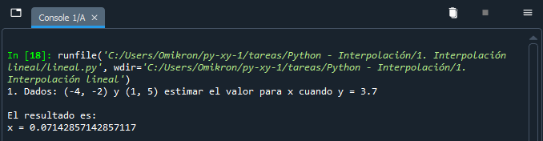

# Diplomado TI para la innovación y el desarrollo 2022

### Módulo 3: Cómputo numérico en Python
### Python – Evaluación de funciones matemáticas

**Presenta:**
Juan Leonardo González Elizondo

**Facilitador:**
María Andrade Aréchiga

## Tarea 3.1: Interpolación lineal

### Problema
Dados: (-4, -2) y (1, 5) estimar el valor para x cuando y = 3.7

### Análisis
Para construir la función en Python que permitirá obtener el valor  de $x$ en una ecuación de interpolación lineal es necesario abstraer la estructura de ésta tras despejar y ordenar las expresiones algebráicas a forma de patrón.

Para este problema, se procedió de la siguiente manera:

**Variables**
|$x_0$|$y_0$|$x_1$|$y_1$|$x$|$y$|
|---|---|---|---|---|---|
|-4|-2|1|5|?|3.7|

**Desarrollo**

$\frac{y-y_0}{x-x_0}=\frac{y_1-y_0}{x_1-x_0}$

$\frac{3.7+2}{x+4}=\frac{5+2}{1+4}$

$(1+4)(3.7+2)=(5+2)(x+4)$

$\frac{(1+4)(3.7+2)}{5+2}=x+4$

$\frac{(1+4)(3.7+2)}{5+2}-4=x$

$x=\frac{(1+4)(3.7+2)}{5+2}-4$

En este punto se encontró la estructura que se plasmará en la función que calculará la interpolación.

$x=\frac{(x_1-x_0)(y-y_0)}{y_1-y_0}+x_0$

A continuación, se procede a resolver el problema original para conocer su resultado para compararlo con el de la función a programar.

$x=\frac{(1+4)(3.7+2)}{5+2}-4$

$x=\frac{28.5}{7}-4$

$x=4.0714-4$

$x=0.0714$

### Código fuente de la práctica
~~~
print("1. Dados: (-4, -2) y (1, 5) estimar el valor para x cuando y = 3.7")

# Función de interpolación lineal para encontrar X
def int_lineal_x(x0,y0,x1,y1,y):
    x = (((x1-x0)*(y-y0))/(y1-y0))+x0
    print("\nEl resultado es:\nx = " + str(x) + "\n")
#end

int_lineal_x(-4,-2,1,5,3.7)
~~~

## Aplicación en ejecución

||
| :-: |
|*Figura 1. Código ejecutado con Spyder*|