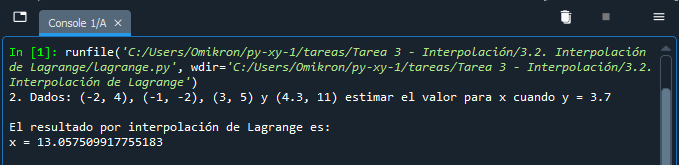

# Diplomado TI para la innovación y el desarrollo 2022

### Módulo 3: Cómputo numérico en Python
### Python – Evaluación de funciones matemáticas

**Presenta:**
Juan Leonardo González Elizondo

**Facilitador:**
María Andrade Aréchiga

## Tarea 3.2. Interpolación de Lagrange

### Problema
Dados: (-2, 4), (-1, -2), (3, 5) y (4.3, 11) estimar el valor para $x$ cuando $y$ = 7.7

### Análisis
Debido a que el problema cuenta con 4 puntos, se requiere generar un polinomio de grado 3, por lo cual se deben de calcular cuatro términos.

$l0 = \frac{(x-x_1)(x-x_2)(x-x_3)}{(x_0-x_1)(x_0-x_2)(x_0-x_3)}$

$l1 = \frac{(x-x_0)(x-x_2)(x-x_3)}{(x_1-x_0)(x_1-x_2)(x_1-x_3)}$

$l2 = \frac{(x-x_0)(x-x_1)(x-x_3)}{(x_2-x_0)(x_2-x_1)(x_2-x_3)}$

$l3 = \frac{(x-x_0)(x-x_1)(x-x_2)}{(x_3-x_0)(x_3-x_1)(x_3-x_2)}$

Con estros cuatro términos definidos, se construye el polinomio usando la fórmula:

$y = y_0l0+y_1l1+y_2l2+y_3l3$

### Código fuente de la práctica
~~~
print("2. Dados: (-2, 4), (-1, -2), (3, 5) y (4.3, 11) estimar el valor para x cuando y = 7.7")

# Función de interpolación de Lagrange de tercer grado
def int_lagrange_y_g3(x0,y0,x1,y1,x2,y2,x3,y3,x):
    l0 = ((x-x1)*(x-x2)*(x-x3))/((x0-x1)*(x0-x2)*(x0-x3))
    l1 = ((x-x0)*(x-x2)*(x-x3))/((x1-x0)*(x1-x2)*(x1-x3))
    l2 = ((x-x0)*(x-x1)*(x-x3))/((x2-x0)*(x2-x1)*(x2-x3))
    l3 = ((x-x0)*(x-x1)*(x-x2))/((x3-x0)*(x3-x1)*(x3-x2))
    
    y = ((y0)*(l0))+((y1)*(l1))+((y2)*(l2))+((y3)*(l3))
    print("\nEl resultado por interpolación de Lagrange es:\nx = " + str(y) + "\n")
#end

int_lagrange_y_g3(-2,4,-1,-2,3,5,4.3,11,7.7)
~~~

## Aplicación en ejecución

||
| :-: |
|*Figura 1. Código ejecutado con Spyder*|