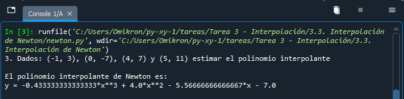

# Diplomado TI para la innovación y el desarrollo 2022

### Módulo 3: Cómputo numérico en Python
### Python – Evaluación de funciones matemáticas

**Presenta:**
Juan Leonardo González Elizondo

**Facilitador:**
María Andrade Aréchiga

## Tarea 3.3. Polinomio interpolante de Newton

### Problema
Dados: (-1, 3), (0, -7), (4, 7) y (5, 11) estimar el polinomio interpolante

### Análisis
Se realiza la estimación entre puntos con diferencias divididas.

$b1 = \frac{y_1-y_0}{x_1-x_0}$

$b2 = \frac{\frac{y_2-y_1}{x_2-x_1}-\frac{y_1-y_0}{x_1-x_0}}{x_2-x_0}$

$b3 = \frac{\frac{\frac{y_3-y_2}{x_3-x_2}-\frac{y_2-y_1}{x_2-x_1}}{x_3-x_1}-\frac{\frac{y_2-y_1}{x_2-x_1}-\frac{y_1-y_0}{x_1-x_0}}{x_2-x_0}}{x_3-x_0}$

Con estros cuatro términos definidos, se construye el polinomio usando la fórmula:

$y = y_0 + b1(x-x_0) + b2(x-x_0)(x-x_1) + b3(x-x_0)(x-x_1)(x-x_2)$

### Código fuente de la práctica
Debido a que el resultado arrojará expresiones en las que $x$ no estará resuelta, se implementó la librería **sympy** para álgebra computacional.
~~~
import sympy as sym
from sympy import *

print("3. Dados: (-1, 3), (0, -7), (4, 7) y (5, 11) estimar el polinomio interpolante")

# Función de polinomio interpolante de Newton
def int_newton(x0,y0,x1,y1,x2,y2,x3,y3):
    x = sym.Symbol('x')
    
    b1 = (y1-y0)/(x1-x0)
    b2 = (((y2-y1)/(x2-x1))-((y1-y0)/(x1-x0)))/(x2-x0)
    b3 = (((((y3-y2)/(x3-x2))-((y2-y1)/(x2-x1)))/(x3-x1))-((((y2-y1)/(x2-x1))-((y1-y0)/(x1-x0)))/(x2-x0)))/(x3-x0)
    
    y = y0 + (b1*(x-x0)) + (b2*(x-x0)*(x-x1)) + (b3*(x-x0)*(x-x1)*(x-x2))
    print("\nEl polinomio interpolante de Newton es:\ny = " + str(simplify(y)) + "\n")
#end

int_newton(-1,3,0,-7,4,7,5,11)
~~~

## Aplicación en ejecución

||
| :-: |
|*Figura 1. Código ejecutado con Spyder*|