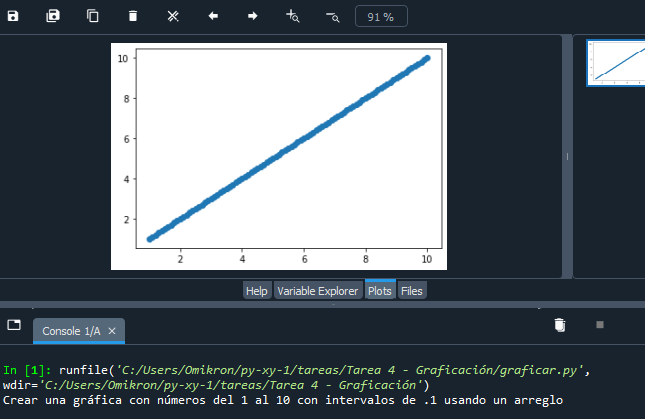

# Diplomado TI para la innovación y el desarrollo 2022

### Módulo 3: Cómputo numérico en Python
### Python – Evaluación de funciones matemáticas

**Presenta:**
Juan Leonardo González Elizondo

**Facilitador:**
María Andrade Aréchiga

## Tarea 4 - Graficación

### Problema
Crear una gráfica con números del 1 al 10 con intervalos de .1 usando un arreglo

### Código fuente de la práctica
Debido a que el problema requiere de un arreglo con con valores del 1 al 10 con salto interválico de .1, se implementó la librería **numpy**, mientras que para la graficación se utilizó **matplotlib**.
~~~
import numpy as np
import matplotlib.pyplot as plt

print("Crear una gráfica con números del 1 al 10 con intervalos de .1 usando un arreglo")

list = np.arange(1,10.1,.1)

plt.scatter(list,list)
~~~

## Aplicación en ejecución

||
| :-: |
|*Figura 1. Código ejecutado con Spyder*|